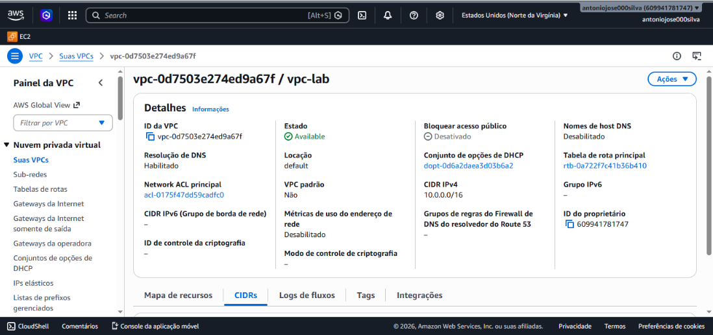
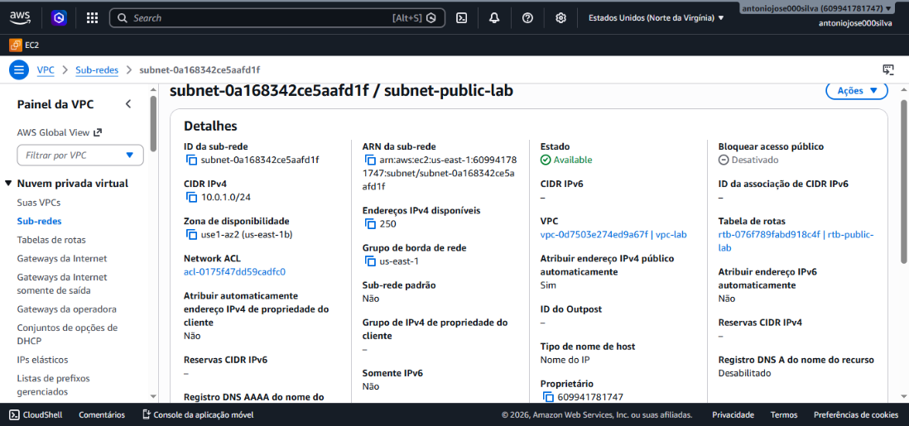
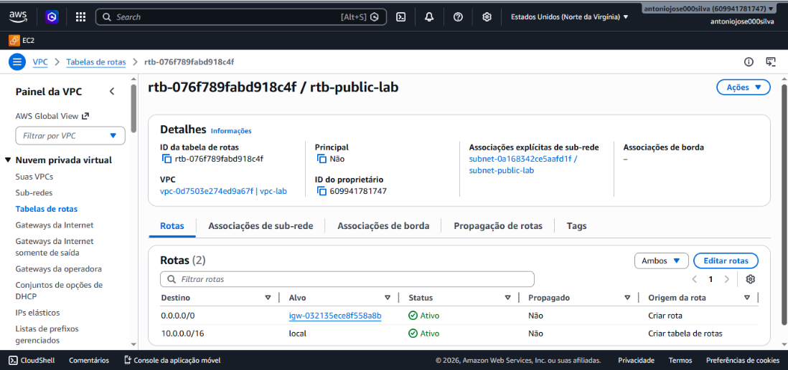
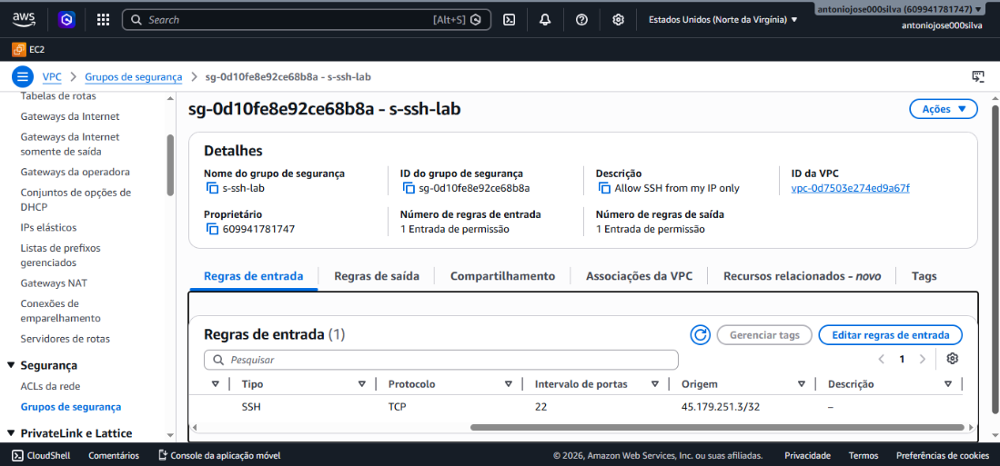
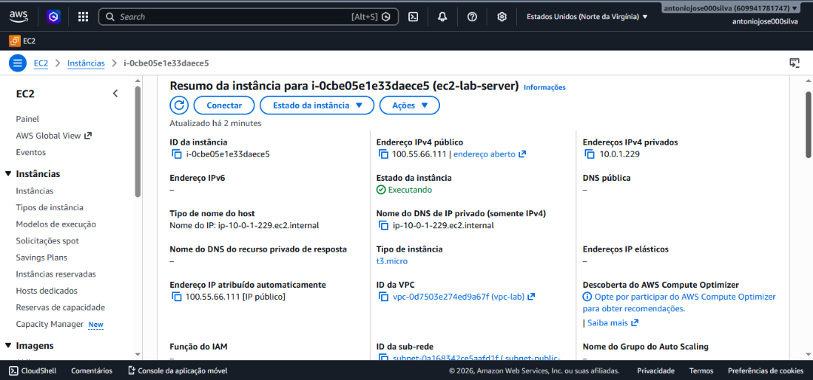
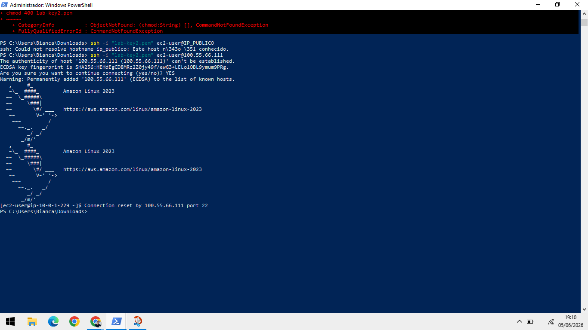

# 🌐 Laboratório AWS - Infraestrutura de Rede e Computação

**Autor:** Antônio José  
**Data:** Junho/2026  
**Curso:** Fundamentos AWS - Computação e Rede

---

## 📌 Sobre o Projeto

Este laboratório demonstra a criação manual de uma infraestrutura completa na AWS, incluindo VPC, sub-rede pública, Internet Gateway, tabela de rotas, security group e uma instância EC2 com acesso SSH validado.

---

## 🏗️ Arquitetura da Solução
┌─────────────────────────────────────┐
│ INTERNET │
└──────────────────┬──────────────────┘
│
▼
┌────────────────────────┐
│ Internet Gateway │
│ (igw-lab) │
└────────────┬───────────┘
│
┌──────────────────────┴──────────────────────┐
│ VPC │
│ 10.0.0.0/16 │
│ ┌──────────────────┐ │
│ │ Route Table │ │
│ │ 0.0.0.0/0 → IGW │ │
│ └────────┬─────────┘ │
│ │ │
│ ┌────────┴────────┐ │
│ │ Sub-rede │ │
│ │ 10.0.1.0/24 │ │
│ └────────┬────────┘ │
│ │ │
│ ┌────────┴────────┐ │
│ │ Security Group │ │
│ │ SSH (22) │ │
│ │ ONLY MyIP/32 │ │
│ └────────┬────────┘ │
│ │ │
│ ┌────────┴────────┐ │
│ │ EC2 Instance │ │
│ │ ec2-lab-server │ │
│ │ IP: 10.0.1.xxx │ │
│ └─────────────────┘ │
└──────────────────────────────────────────────┘

---

## 📊 Recursos Criados

| Recurso | Nome | Configuração |
|---------|------|--------------|
| **VPC** | `vpc-lab` | 10.0.0.0/16 |
| **Sub-rede Pública** | `subnet-public-lab` | 10.0.1.0/24 |
| **Internet Gateway** | `igw-lab` | Anexado à VPC |
| **Tabela de Rotas** | `rtb-public-lab` | 0.0.0.0/0 → IGW |
| **Security Group** | `sg-ssh-lab` | Porta 22 liberada (meu IP) |
| **Instância EC2** | `ec2-lab-server` | Amazon Linux 2023, **t3.micro** |

---

## 📸 Prints do Laboratório

### 1. VPC Criada


### 2. Sub-rede Pública


### 3. Tabela de Rotas


### 4. Security Group


### 5. Instância EC2 em Execução


### 6. Acesso SSH Funcionando


---

## 🔧 Como o Acesso SSH Foi Realizado

Após a criação da instância, o acesso via SSH foi realizado através do seguinte comando:

```bash
ssh -i "lab-key2.pem" ec2-user@100.55.66.111

Resultado: O prompt [ec2-user@ip-10-0-1-xxx ~]$ foi exibido, confirmando o acesso bem-sucedido à instância.

📝 Função de Cada Recurso
Recurso	Função
VPC	Rede virtual isolada que define o espaço de endereçamento IP (10.0.0.0/16)
Sub-rede Pública	Subdivisão da VPC que permite às instâncias receberem IPs públicos
Internet Gateway	Permite comunicação bidirecional entre a VPC e a internet
Tabela de Rotas	Define para onde o tráfego de rede deve ser direcionado (rota 0.0.0.0/0 → IGW)
Security Group	Firewall virtual que controla tráfego de entrada/saída na instância
EC2	Máquina virtual que hospeda a aplicação/serviço
✅ Conclusão
O laboratório foi concluído com sucesso, demonstrando na prática:

A criação de uma VPC com sub-rede pública

Configuração de Internet Gateway e tabelas de rotas

Configuração de segurança com Security Group

Implantação e acesso a uma instância EC2

Status: APROVADO ✓

**Observação:** Foi utilizada a AMI **Amazon Linux 2023 (AL2023)** com instância **t3.micro**, ambos totalmente elegíveis para o Free Tier da AWS.

👤 Autor
José - Laboratório de Infraestrutura AWS
